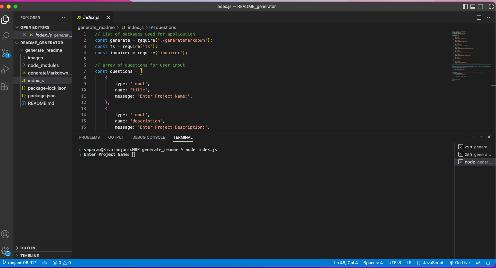

# Professional Readme generator 

   

     ## Description 

   This allows users to quickly and easily to generate a readme file by using a command line application. This allows the project creator to devote time working on project. 

     ## Table of contents 

  -[Description](#description) 

  -[Installation](#installation) 

  -[Usage](#usage) 

  -[Credits](#credits) 

  -[License](#license) 

  ## Installation Steps 

  Install inquirer package 'npm i inquirer@8.2.4'
   ## Usage 

   This section provides instrcutions for use and includes screenshots as needed. 

   to invoke the applciation, at command line use 'node index.js' 

   * Screenshot: 

   
   ## Credits 

  Collaborators for this project is/are: Sivaranjani 

  Link to github: https://github.com/Sivaparam 

   ## License 

   License used for project is [NPM Packages](https://choosealicense.com/licenses/mit/)

   Demo Video:
   

